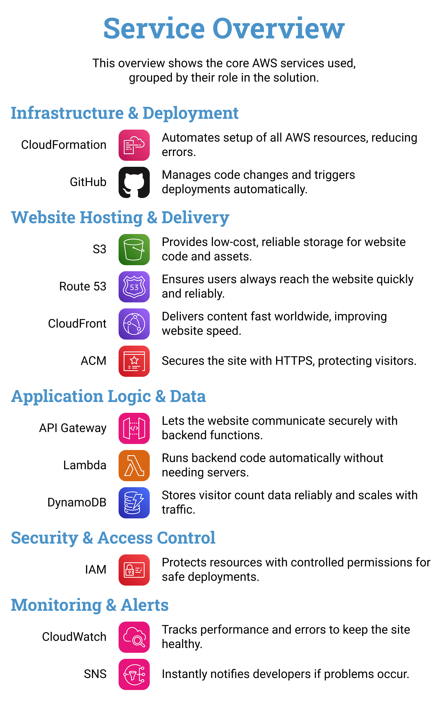
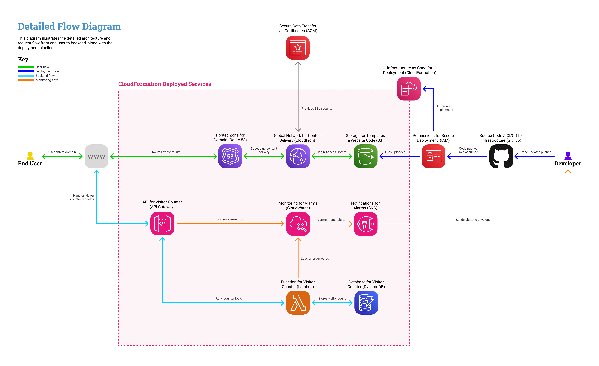

<<<<<<< HEAD
# Serverless Resume Website on AWS  
=======
# Cloud Resume Challenge - Serverless Resume Website on AWS  
>>>>>>> 15cf09257ec2cd1e0f9fbbb124f64d1765eed9ff

A cloud-hosted resume website demonstrating **practical AWS engineering skills**.  
This project implements a static website with a visitor counter, full CI/CD automation, and infrastructure as code, covering the **core capabilities of a cloud engineer**.  

Built as part of the [Cloud Resume Challenge](https://cloudresumechallenge.dev/docs/the-challenge/aws), the repository highlights:  
- **Cloud Infrastructure**: S3, CloudFront, Route 53, API Gateway, Lambda, DynamoDB, CloudWatch, IAM, ACM  
- **Automation**: GitHub Actions CI/CD pipelines, CloudFormation templates  
- **Best Practices**: Monitoring, least-privilege IAM, cleanup instructions  

---

## Project Overview  

- **Non-Technical Summary**: A personal resume website, served securely and globally through AWS. Visitors can view my resume and see a live counter that tracks how many people have accessed the site.  
- **Technical Summary**: A static front end on S3 + CloudFront, secured with TLS (ACM), custom domain via Route 53, dynamic visitor counter via API Gateway → Lambda → DynamoDB, all monitored by CloudWatch, and deployed automatically with GitHub Actions.  

---

## Architecture  

### High-Level Diagram (non-technical)  
<<<<<<< HEAD

Shows how a visitor reaches the site (browser → secure AWS hosting → visitor count).  

### Detailed Flow (technical)  

Covers CI/CD pipeline, request/response path, logging, and permissions.  

---

## Deployment Instructions  

### Prerequisites  
- AWS account with admin access  
- Registered domain in Route 53  
- GitHub repository forked/cloned  

### Steps  
1. Clone repo and configure GitHub Actions secrets (AWS credentials).  
2. Deploy CloudFormation templates for:  
   - S3/CloudFront/ACM hosting  
   - API Gateway, Lambda, DynamoDB  
   - IAM roles/policies  
3. Push code → GitHub Actions builds & deploys.  

---

## IAM Policies  

- Policies are written with **wildcards** to ease initial deployment.  
- For production use, replace wildcards with **specific ARNs** once resources are created.  
- See [POLICY.md](documentation/POLICY.md) for full explanation.  

---

## Testing the Site  

1. Visit your domain (e.g. `https://yourdomain.com`).  
2. Confirm the resume page loads.  
3. Refresh to check visitor counter increments.  
4. Review CloudWatch logs for Lambda/API Gateway.  

---

## Cleanup  

To avoid costs:  
- Delete CloudFormation stacks.  
- Remove S3 buckets, Route 53 records, and DynamoDB tables if needed.  
- Disable or delete CI/CD GitHub Actions.  
=======

Shows how a visitor reaches the site (browser → secure AWS hosting → visitor count).  

### Detailed Flow (technical)  

Covers CI/CD pipeline, request/response path, logging, and permissions.  

---

## Deployment Instructions  

### Prerequisites  
- AWS account with admin access  
- Registered domain in Route 53  
- GitHub repository forked/cloned  

### Steps  
1. Clone repo and configure GitHub Actions secrets (AWS credentials).  
2. Deploy CloudFormation templates for:  
   - S3/CloudFront/ACM hosting  
   - API Gateway, Lambda, DynamoDB  
   - IAM roles/policies  
3. Push code → GitHub Actions builds & deploys.  

---

## IAM Policies  

- Policies are written with **wildcards** to ease initial deployment.  
- For production use, replace wildcards with **specific ARNs** once resources are created.  
- See [POLICY.md](documentation/POLICY.md) for full explanation.  

---

## Testing the Site  

1. Visit your domain (e.g. `https://yourdomain.com`).  
2. Confirm the resume page loads.  
3. Refresh to check visitor counter increments.  
4. Review CloudWatch logs for Lambda/API Gateway.  

---

## Cleanup  

To avoid costs:  
- Delete CloudFormation stacks.  
- Remove S3 buckets, Route 53 records, and DynamoDB tables if needed.  
- Disable or delete CI/CD GitHub Actions.  
>>>>>>> 15cf09257ec2cd1e0f9fbbb124f64d1765eed9ff
